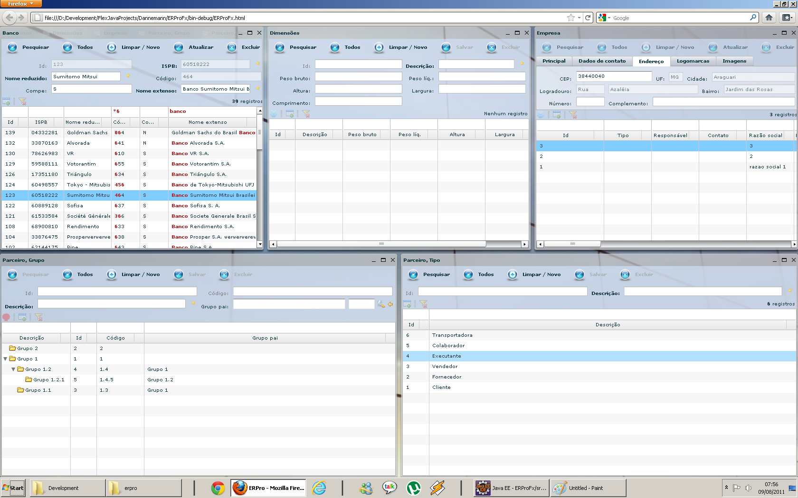

### x-front-flex is a scaffolding framework I developed in ActionScript/Flex as the final project for my bachelor's degree, around 2007–2009. It generates complete CRUD views not only for the primary entity but also for its associations, using a rich internet application (RIA) front-end for the web. The framework features a complete window management system (similar to Windows, but in the browser), dozens of UI components, and numerous utility objects for handling animations, effects, formatting, rendering, validation, and more. As the technology has become obsolete, I no longer have a live example available. Screenshots of the framework in action are shown below:

Interactive table with multi-level grouping

Search on many-to-one associations

Quick search on many-to-one associations

Quick search on table (including regular expressions)

Validation (automatically generated based on JPA annotations)

Main menu (automatically generated based on entities)

Alerts

Quick search views 

Snap layout

Login

Maximized view

Screen with quick image view

Table only mode

Cascade

Environment set up:
===================
### External config.:
* Install Flash player debuggers: **https://www.adobe.com/support/flashplayer/debug_downloads.html**

### Flash Builder preferences:
* Set the correct Flex SDK.

### Optional Flash Builder preferences:
* Set the player debugger to the most recent one (Window->Preferences->Flash Builder->Debug).
* Always launch the previously launched application.
* Set the preferred browser (Chrome will need crossdomain.xml).
* Disable welcome screen and *"Check if Help Documentation is installed in your language on startup"*.

Project set up:
===============
1. Import this project to Flash Builder as a **Flex Library Project** named **xfront-flex**. 
1. Append the compiler options: **-locale=en_US,pt_BR -source-path=locale/{locale} -include-file defaults.css assets/css/defaults.css -keep**
